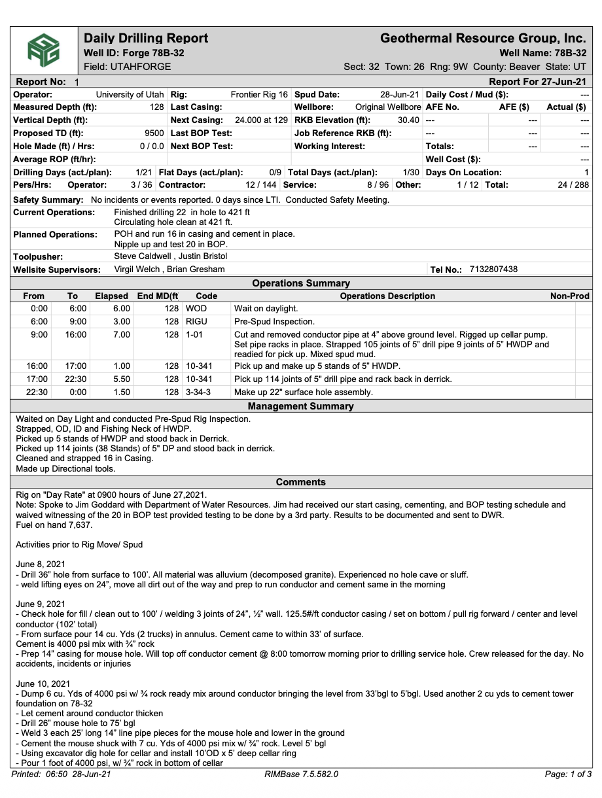
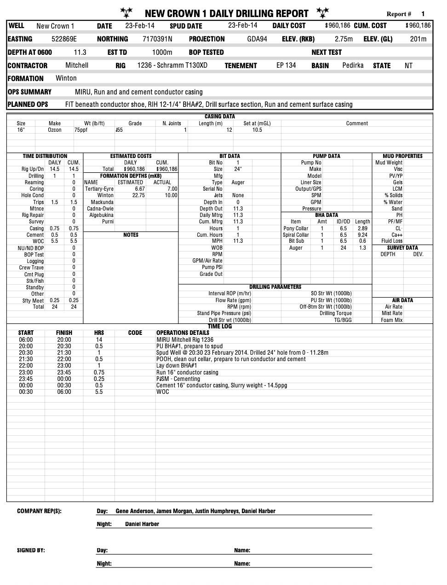
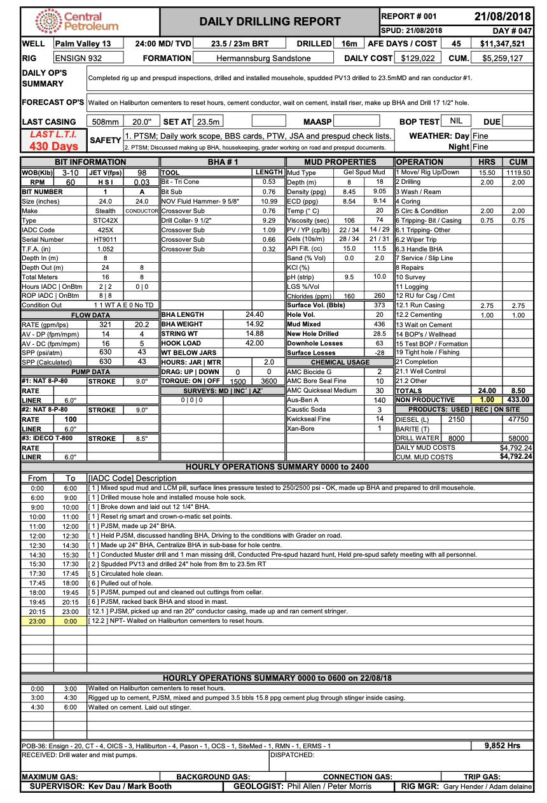
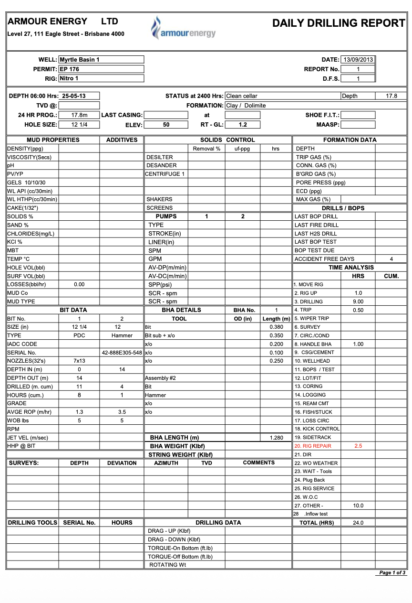
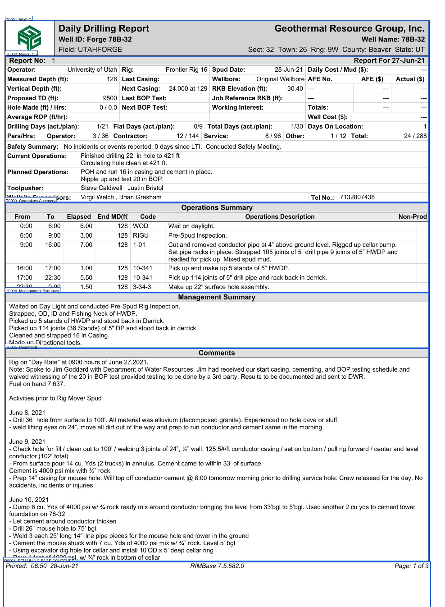
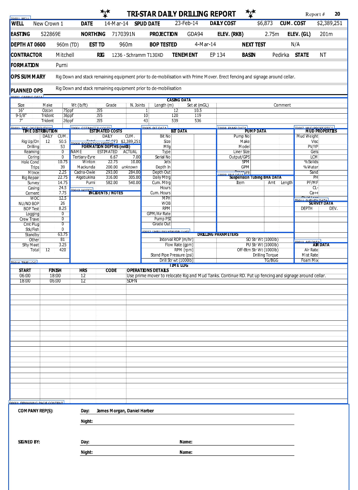
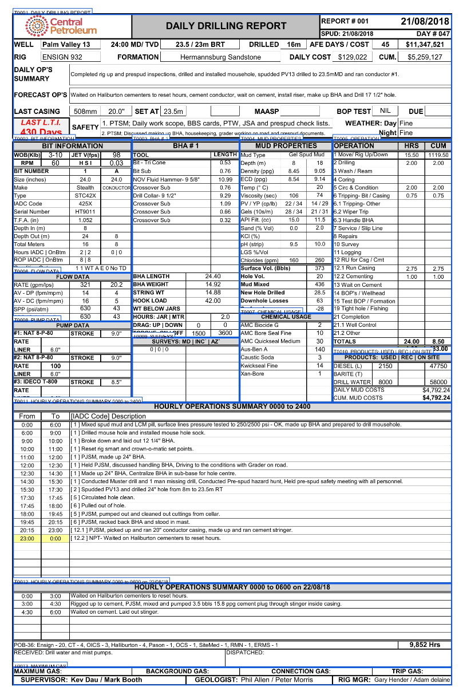
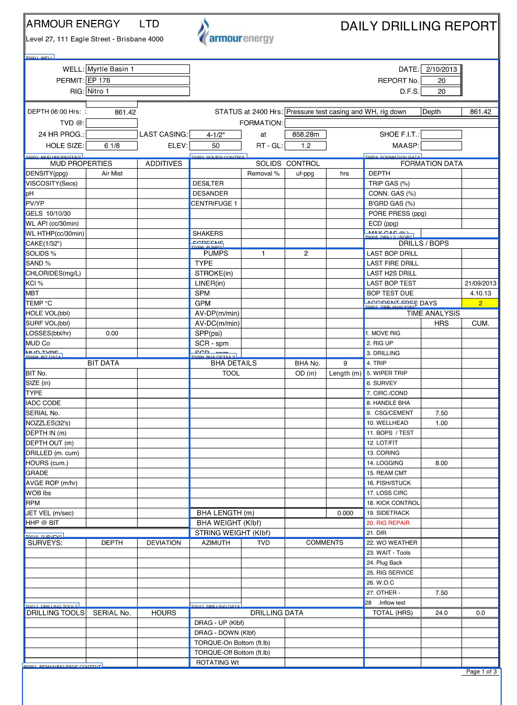
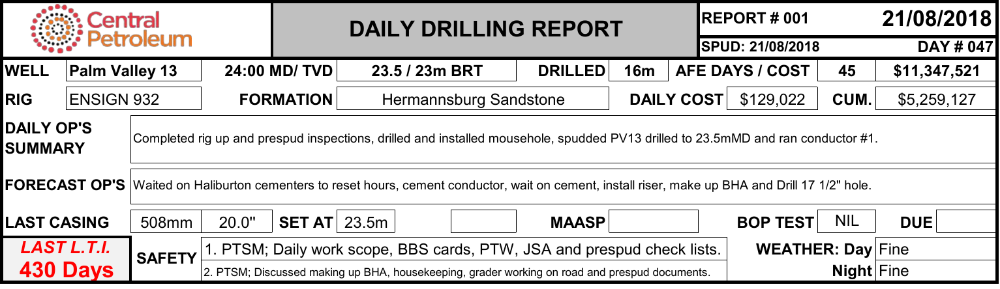

# PDF Report Table Extractor

A preprocessing pipeline for splitting complex **Daily Drilling Report** PDFs into smaller, meaningful table images before sending them to OCR models.

The project is designed around a practical problem: dense engineering reports usually contain several tables, columns, merged cells, labels, and narrative sections on the same page. Sending the complete page directly to an OCR model often produces incorrect reading order, mixed sections, or broken table structures.

This pipeline separates each report into clearly defined regions first, making the resulting images easier to inspect, compare, and process with OCR.

---

## The Problem

Daily Drilling Reports are visually dense and highly structured. A single page may contain:

- operational summaries;
- drilling parameters;
- bit and BHA information;
- mud properties;
- pump and flow data;
- hourly activity tables;
- cost and chemical usage sections;
- merged cells and multi-column layouts.

Different document sources may also use different report templates.

### Example source documents

<table>
  <tr>
    <td align="center">
      
      <br><strong>Sample 1</strong>
    </td>
    <td align="center">
      
      <br><strong>Sample 2</strong>
    </td>
  </tr>
  <tr>
    <td align="center">
      
      <br><strong>Sample 3</strong>
    </td>
    <td align="center">
      
      <br><strong>Sample 4</strong>
    </td>
  </tr>
</table>

Instead of asking an OCR model to understand each complete page at once, the project first detects and crops the important sections.

---

## Pipeline

```text
Source PDFs
    │
    ▼
Split multi-report documents
    │
    ▼
Select the matching report layout
    │
    ▼
Detect titled sections and table boundaries
    │
    ▼
Export one image per section
    │
    ├── Annotated validation map
    ├── JSON metadata
    └── Text-layer cache
    │
    ▼
Send the cropped images to OCR models
    │
    ▼
Compare structured Markdown / HTML outputs
```

The current repository covers the preprocessing and table-extraction stages. OCR model outputs are included as a qualitative comparison, but OCR execution is not yet integrated into the main scripts.

---

## Installation

### Requirements

- Python 3.10 or newer
- Poppler
- Python packages listed in `requirements.txt`

### 1. Clone the repository

```bash
git clone https://github.com/mhnajafi7/pdf-report-table-extractor.git
cd pdf-report-table-extractor
```


### 2. Create a virtual environment

Linux or macOS:

```bash
python3 -m venv .venv
source .venv/bin/activate
```

Windows PowerShell:

```powershell
python -m venv .venv
.venv\Scripts\Activate.ps1
```

### 3. Install Python dependencies

```bash
python -m pip install --upgrade pip
pip install -r requirements.txt
```

### 4. Install Poppler

Ubuntu or Debian:

```bash
sudo apt-get update
sudo apt-get install poppler-utils
```

macOS:

```bash
brew install poppler
```

Fedora:

```bash
sudo dnf install poppler-utils
```

Arch Linux:

```bash
sudo pacman -S poppler
```

On Windows, install a Poppler build and add its `bin` directory to `PATH`.

Verify the installation:

```bash
pdftoppm -h
```

---

## Quick Start

### Step 1 — Add the source PDFs

Place the original multi-report PDF files inside:

```text
Docs/
```

### Step 2 — Split the source documents

```bash
chmod +x 01_split_docs.sh
./01_split_docs.sh
```

For each PDF, the script asks:

```text
Start page [1]:
End page [last page]:
Pages per report:
```

Press Enter to use the first page as the default start or the final PDF page as the default end.

The generated reports are placed inside `splits/`, with one folder per report.

### Step 3 — Extract table regions

```bash
chmod +x 02_extract_tables.sh
./02_extract_tables.sh
```

For each document group, choose the matching definition from:

```text
Types/
├── type1.txt
├── type2.txt
├── type3.txt
└── type4.txt
```

The selected Type file describes the titles and boundaries expected in that report layout (you can add your own documents types).

### Step 4 — Review the generated outputs

Each processed report receives a `table_bundle/` directory:

```text
splits/
└── source-document/
    └── source-document_001/
        ├── source-document_001.pdf
        └── table_bundle/
            ├── slice__0001__p001__DAILY-DRILLING-REPORT.png
            ├── slice__0002__p001__BIT-INFORMATION.png
            ├── slice__0003__p001__BHA-1.png
            ├── ...
            ├── map__all_tables.pdf
            ├── data__tables.json
            └── cache__text_layer.json
```

The `slice__*.png` files are the table and section images prepared for OCR.

---

## Visual Validation Maps

For every processed report, the pipeline generates an annotated map showing the detected regions on the original page.

These maps make it possible to verify the section boundaries before sending the cropped images to OCR.

<table>
  <tr>
    <td align="center">
      
      <br><strong>Sample 1 — detected regions</strong>
    </td>
    <td align="center">
      
      <br><strong>Sample 2 — detected regions</strong>
    </td>
  </tr>
  <tr>
    <td align="center">
      
      <br><strong>Sample 3 — detected regions</strong>
    </td>
    <td align="center">
      
      <br><strong>Sample 4 — detected regions</strong>
    </td>
  </tr>
</table>

Each blue region corresponds to a separate PNG slice.

---

## Layout Definitions

The files inside `Types/` define which sections should be extracted from each report layout.

Example:

```text
DAILY DRILLING REPORT
BIT INFORMATION
BHA # 1
MUD PROPERTIES
OPERATION
FLOW DATA
PUMP DATA
SURVEYS
CHEMICAL USAGE
PRODUCTS: USED | REC | ON SITE
HOURLY OPERATIONS SUMMARY 0000 to 2400
MAXIMUM GAS --- TRIP GAS
```

A plain title uses automatic boundary detection:

```text
MUD PROPERTIES
```

Two hyphens define an exclusive ending marker:

```text
MUD PROPERTIES -- ADDITIVES
```

The ending section is used as a boundary but is not included in the crop.

Three hyphens define an inclusive ending marker:

```text
MAXIMUM GAS --- TRIP GAS
```

The ending section is included in the crop.

Optional line selectors can refine the final boundaries:

```text
COSTS /// U1 D1 L2 R1
```

This configuration-based approach allows multiple report layouts to use the same extraction pipeline.

---

## OCR Comparison

After the report sections are extracted, individual slices can be sent to OCR or vision-language models.

The following image was used as a shared OCR input:

<p align="center">
  
</p>

The same image was processed by several document-understanding and OCR systems.

| Model / system | Extracted output |
|---|---|
| AllenAI olmOCR 2 7B 1025 | [`allenaiolmOCR-2-7B-1025.md`](ocr-comparison/allenaiolmOCR-2-7B-1025.md) |
| Datalab / ToChandra OCR | [`datalab-tochandraOCR.md`](ocr-comparison/datalab-tochandraOCR.md) |
| MinerU | [`mineru.md`](ocr-comparison/mineru.md) |
| PaddleOCR | [`paddleOCR16.md`](ocr-comparison/paddleOCR16.md) |
| Baidu Unlimited OCR | [`baiduUnlimitedOCR.md`](ocr-comparison/baiduUnlimitedOCR.md) |

The comparison highlights differences in text recognition, reading order, table reconstruction, merged-cell handling, and Markdown/HTML structure.

This is currently a qualitative comparison rather than a formal benchmark. No OCR model is installed or executed by the main pipeline.

---

## Output Files

### Table slices

```text
slice__NNNN__pPPP__section-title.png
```

Each file contains one detected table or semantic report section.

### Validation map

```text
map__all_tables.pdf
```

An annotated version of the report showing every extracted region.

### Metadata

```text
data__tables.json
```

Contains the source document, section title, page number, crop coordinates, boundary strategy, output filename, and pipeline settings.

### Text cache

```text
cache__text_layer.json
```

Stores extracted text and coordinates so repeated runs can reuse the PDF text layer.

---
## References and Data Sources

### OCR Projects

The extracted table image was evaluated using outputs from the following OCR and document-understanding projects:

- [AllenAI olmOCR](https://github.com/allenai/olmocr)
- [Datalab Chandra OCR](https://github.com/datalab-to/chandra)
- [MinerU](https://github.com/opendatalab/MinerU)
- [PaddleOCR](https://github.com/PaddlePaddle/PaddleOCR)
- [Baidu Unlimited-OCR](https://github.com/baidu/Unlimited-OCR)


### Document Sources

The sample documents used to develop and demonstrate the extraction pipeline were obtained from the following sources:

1. Federal Aviation Administration, *FAA Form 337: Major Repair and Alteration*, 2006.
2. D. G. Jackson, *Annual Report for EL 18/91 – Mangana, 30 May 1999 to 29 May 2000*, Defiance Mining NL, 2000.
3. John McLennan, *Utah FORGE: Well 78B-32 Daily Drilling Reports and Logs*, 2021.
4. Central Petroleum, *Palm Valley 13 Well Completion Report: Appendix F – Daily Drilling Reports*, 2018.
5. Teikoku Oil, *Sunbird-1 Well Completion Report: Appendix 1 – Daily Drilling Reports*, 1994.
6. Tri-Star Energy, *New Crown 1 Well Completion Report: Appendix 8 – Daily Drilling Reports*, 2014.
7. Armour Energy, *Myrtle Basin 1 Well Completion Report Appendices: Daily Drilling Report*, 2013.


---

## Limitations

The current extraction stage works best with text-based PDFs where the text can be selected or extracted.

Image-only scans may require OCR before title matching can be performed.

Each new report design may require a new file inside `Types/` or adjustments to an existing definition.

---


## License

See [`LICENSE`](LICENSE) for licensing information.
